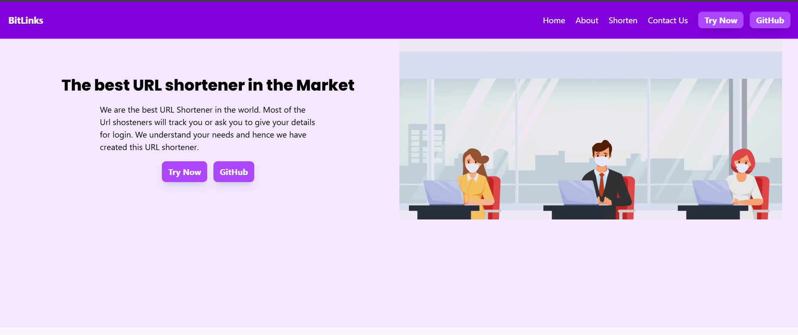

# BitLinks - Your Trusted URL Shortener 🔗

BitLinks is a simple and fast URL shortener built with Next.js and MongoDB 🚀 This project helps you convert long, messy links into short, shareable URLs in seconds — no tracking, no unnecessary sign-ups, just a clean and reliable shortening service.




## Features
- **Simple Shortening** – Convert long URLs to short links instantly
- **Contact Form** – Reach out directly through the built-in contact page
- **Modern Stack** – Built with Next.js (App Router), React, Tailwind CSS, and MongoDB

## Tech Stack
- Next.js 15 (App Router)
- React
- Tailwind CSS
- MongoDB (Dockerized for local development)

## Getting Started
1. Clone the repo
2. Run `npm install`
3. Start MongoDB via Docker
4. Run `npm run dev`
5. Open `http://localhost:3000`
#

# BitLinks Project End to End Implementation

### In this demo, we will see how to deploy an end to end three tier MERN stack application on EKS cluster.
#
### <mark>Project Deployment Flow:</mark>


#

## Tech stack used in this project:
- GitHub (Code)
- Docker (Containerization)
- Jenkins (CI)
- OWASP (Dependency check)
- SonarQube (Quality)
- Trivy (Filesystem Scan)
- Jenkins (CD)
- AWS EC2(Instances)
- Monitoring using grafana and prometheus

### How pipeline will look after deployment:
- <b>CI pipeline to build and push</b>


- <b>CD pipeline to update application version</b>


#
> [!Important]
> Below table helps you to navigate to the particular tool installation section fast.

| Tech stack    | Installation |
| -------- | ------- |
| Jenkins Master | <a href="#Jenkins">Install and configure Jenkins</a>     |
| Jenkins-Worker Setup | <a href="#Jenkins-worker">Install and configure Jenkins Worker Node</a>     |
| OWASP setup | <a href="#Owasp">Install and configure OWASP</a>     |
| SonarQube | <a href="#Sonar">Install and configure SonarQube</a>     |
| Email Notification Setup | <a href="#Mail">Email notification setup</a>     |
| Monitoring | <a href="#Monitor">Prometheus and grafana setup using helm charts</a>
| Clean Up | <a href="#Clean">Clean up</a>     |
#

### Pre-requisites to implement this project:
#

> [!Note]
> This project will be implemented on Ohio region (us-east-2).

- <b>Create 1 Master machine on AWS with 2CPU, 4GB of RAM (c7i-flex.large) and 15 GB of storage and install Docker on it.</b>
#
- <b>Open the below ports in security group of master machine and also attach same security group to Jenkins worker node (We will create worker node shortly)</b>


#

> [!Note]
> We are creating this master machine because we will configure Jenkins master, eksctl, EKS cluster creation from here.

Install & Configure Docker by using below command, "NewGrp docker" will refresh the group config hence no need to restart the EC2 machine.

```bash
sudo apt-get update
```
```bash
sudo apt-get install docker.io -y
sudo usermod -aG docker ubuntu && newgrp docker
```
#
- <b id="Jenkins">Install and configure Jenkins (Master machine)</b>
```bash
sudo apt update -y
sudo apt install fontconfig openjdk-17-jre -y

sudo wget -O /usr/share/keyrings/jenkins-keyring.asc \
  https://pkg.jenkins.io/debian-stable/jenkins.io-2023.key
  
echo "deb [signed-by=/usr/share/keyrings/jenkins-keyring.asc]" \
  https://pkg.jenkins.io/debian-stable binary/ | sudo tee \
  /etc/apt/sources.list.d/jenkins.list > /dev/null
  
sudo apt-get update -y
sudo apt-get install jenkins -y
```
- <b>Now, access Jenkins Master on the browser on port 8080 and configure it</b>.

#
  - <b>generate ssh keys (Master machine) to setup jenkins master-slave</b>
  ```bash
  ssh-keygen
  ```
  
#
  - <b>Now move to directory where your ssh keys are generated and copy the content of public key and paste to authorized_keys file of the Jenkins worker node.</b>
#
  - <b>Now, go to the jenkins master and navigate to <mark>Manage jenkins --> Nodes</mark>, and click on Add node </b>
    - <b>name:</b> bitlinks_
    - <b>type:</b> permanent agent
    - <b>Number of executors:</b> 2
    - Remote root directory
    - <b>Labels:</b> Node
    - <b>Usage:</b> Only build jobs with label expressions matching this node
    - <b>Launch method:</b> Via ssh
    - <b>Host:</b> \<public-ip-worker-jenkins\>
    - <b>Credentials:</b> <mark>Add --> Kind: ssh username with private key --> ID: Worker --> Description: Worker --> Username: root --> Private key: Enter directly --> Add Private key</mark>
    - <b>Host Key Verification Strategy:</b> Non verifying Verification Strategy
    - <b>Availability:</b> Keep this agent online as much as possible
#
  - And your jenkins worker node is added


# 
- <b id="docker">Install docker (Jenkins Worker)</b>

```bash
sudo apt install docker.io -y
sudo usermod -aG docker ubuntu && newgrp docker
```
#
- <b id="Sonar">Install and configure SonarQube (Master machine)</b>
```bash
docker run -itd --name SonarQube-Server -p 9000:9000 sonarqube:lts-community
```
#
- <b id="Trivy">Install Trivy (Jenkins Worker)</b>
```bash
sudo apt-get install wget apt-transport-https gnupg lsb-release -y
wget -qO - https://aquasecurity.github.io/trivy-repo/deb/public.key | sudo apt-key add -
echo deb https://aquasecurity.github.io/trivy-repo/deb $(lsb_release -sc) main | sudo tee -a /etc/apt/sources.list.d/trivy.list
sudo apt-get update -y
sudo apt-get install trivy -y
```

#
## Steps to add email notification
- <b id="Mail">Go to your Jenkins Master EC2 instance and allow 465 port number for SMTPS</b>
#
- <b>Now, we need to generate an application password from our gmail account to authenticate with jenkins</b>
  - <b>Open gmail and go to <mark>Manage your Google Account --> Security</mark></b>
> [!Important]
> Make sure 2 step verification must be on


  - <b>Search for <mark>App password</mark> and create a app password for jenkins</b>

  

#
- <b> Once, app password is create and go back to jenkins <mark>Manage Jenkins --> Credentials</mark> to add username and password for email notification</b>


# 
- <b> Go back to <mark>Manage Jenkins --> System</mark> and search for <mark>Extended E-mail Notification</mark></b>


#
- <b>Scroll down and search for <mark>E-mail Notification</mark> and setup email notification</b>
> [!Important]
> Enter your gmail password which we copied recently in password field <mark>E-mail Notification --> Advance</mark>


#
## Steps to implement the project:
- <b>Go to Jenkins Master and click on <mark> Manage Jenkins --> Plugins --> Available plugins</mark> install the below plugins:</b>
  - OWASP
  - SonarQube Scanner
  - Docker
  - Pipeline: Stage View
#
- <b id="Owasp">Configure OWASP, move to <mark>Manage Jenkins --> Plugins --> Available plugins</mark> (Jenkins Worker)</b>


- <b id="Sonar">After OWASP plugin is installed, Now move to <mark>Manage jenkins --> Tools</mark> (Jenkins Worker)</b>


#
- <b>Login to SonarQube server and create the credentials for jenkins to integrate with SonarQube</b>

  - Navigate to <mark>Administration --> Security --> Users --> Token</mark>


#
- <b>Now, go to <mark> Manage Jenkins --> credentials</mark> and add Sonarqube credentials:</b>

#
- <b>Go to <mark> Manage Jenkins --> Tools</mark> and search for SonarQube Scanner installations:</b>

#
- <b> Go to <mark> Manage Jenkins --> credentials</mark> and add Github credentials to push updated code from the pipeline:</b>


> [!Note]
> While adding github credentials add Personal Access Token in the password field.
#
- <b>Go to <mark> Manage Jenkins --> System</mark> and search for SonarQube installations:</b>


#
- <b>Now again, Go to <mark> Manage Jenkins --> System</mark> and search for Global Trusted Pipeline Libraries:</b
  

  

#
- <b>Login to SonarQube server, go to <mark>Administration --> Webhook</mark> and click on create </b>


#
- <b>Now, go to github repository and under <mark>Automations</mark> directory update the <mark>instance-id</mark> field on both the <mark>updatefrontendnew.sh updatebackendnew.sh</mark> with the k8s worker's instance id</b>

#
- <b>Navigate to <mark> Manage Jenkins --> credentials</mark> and add credentials for docker login to push docker image:</b>

#
- <b>Create a <mark>Wanderlust-CI</mark> pipeline</b>


#
- <b>Create one more pipeline <mark>Wanderlust-CD</mark></b>


#
- <b>Provide permission to docker socket so that docker build and push command do not fail (Jenkins Worker)</b>
```bash
chmod 777 /var/run/docker.sock
```

#
- <b> Go to Master Machine and add our own eks cluster to argocd for application deployment using cli</b>
  - <b>Login to argoCD from CLI</b>
  ```bash
   argocd login 52.53.156.187:32738 --username admin
  ```
> [!Tip]
> 52.53.156.187:32738 --> This should be your argocd url

  

  - <b>Check how many clusters are available in argocd </b>
  ```bash
  argocd cluster list
  ```
  
  - <b>Get your cluster name</b>
  ```bash
  kubectl config get-contexts
  ```
  
  - <b>Add your cluster to argocd</b>
  ```bash
  argocd cluster add Wanderlust@wanderlust.us-west-1.eksctl.io --name wanderlust-eks-cluster
  ```
  > [!Tip]
  > Wanderlust@wanderlust.us-west-1.eksctl.io --> This should be your EKS Cluster Name.

  
  - <b> Once your cluster is added to argocd, go to argocd console <mark>Settings --> Clusters</mark> and verify it</b>
  
#
- <b>Go to <mark>Settings --> Repositories</mark> and click on <mark>Connect repo</mark> </b>


> [!Note]
> Connection should be successful

- <b>Now, go to <mark>Applications</mark> and click on <mark>New App</mark></b>


> [!Important]
> Make sure to click on the <mark>Auto-Create Namespace</mark> option while creating argocd application


- <b>Congratulations, your application is deployed on AWS EKS Cluster</b>


- <b>Open port 31000 and 31100 on worker node and Access it on browser</b>
```bash
<worker-public-ip>:31000
```


- <b>Email Notification</b>


#
## How to monitor EKS cluster, kubernetes components and workloads using prometheus and grafana via HELM (On Master machine)
- <p id="Monitor">Install Helm Chart</p>
```bash
curl -fsSL -o get_helm.sh https://raw.githubusercontent.com/helm/helm/main/scripts/get-helm-3
```
```bash
chmod 700 get_helm.sh
```
```bash
./get_helm.sh
```

#
-  Add Helm Stable Charts for Your Local Client
```bash
helm repo add stable https://charts.helm.sh/stable
```

#
- Add Prometheus Helm Repository
```bash
helm repo add prometheus-community https://prometheus-community.github.io/helm-charts
```

#
- Create Prometheus Namespace
```bash
kubectl create namespace prometheus
```
```bash
kubectl get ns
```

#
- Install Prometheus using Helm
```bash
helm install stable prometheus-community/kube-prometheus-stack -n prometheus
```

#
- Verify prometheus installation
```bash
kubectl get pods -n prometheus
```

#
- Check the services file (svc) of the Prometheus
```bash
kubectl get svc -n prometheus
```

#
- Expose Prometheus and Grafana to the external world through Node Port
> [!Important]
> change it from Cluster IP to NodePort after changing make sure you save the file and open the assigned nodeport to the service.

```bash
kubectl edit svc stable-kube-prometheus-sta-prometheus -n prometheus
```


#
- Verify service
```bash
kubectl get svc -n prometheus
```

#
- Now,let’s change the SVC file of the Grafana and expose it to the outer world
```bash
kubectl edit svc stable-grafana -n prometheus
```


#
- Check grafana service
```bash
kubectl get svc -n prometheus
```

#
- Get a password for grafana
```bash
kubectl get secret --namespace prometheus stable-grafana -o jsonpath="{.data.admin-password}" | base64 --decode ; echo
```
> [!Note]
> Username: admin

#
- Now, view the Dashboard in Grafana


#
## Clean Up
- <b id="Clean">Delete eks cluster</b>
```bash
eksctl delete cluster --name=wanderlust --region=us-west-1
```

#

## License
MIT
